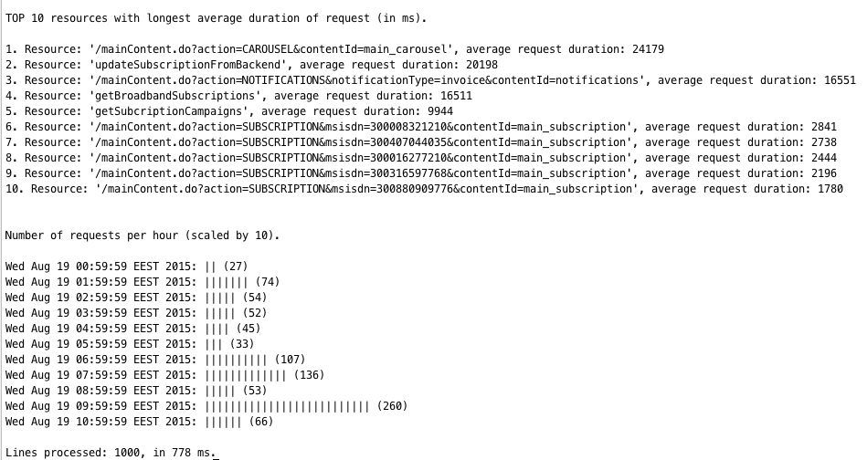

# Timing log parser


The parser is designed for parsing timing logs from web services(based on Struts 1/2).
The target of current implementation wasn't performance but rather flexibility and readability of the solution.

## Requirements

1. [JRE/JDK 8](http://www.oracle.com/technetwork/java/javase/downloads/index.html)
2. [Apache Maven](https://maven.apache.org/download.cgi)

## Usage

For launching the utility use the following command:

```shell
java -jar timing-report.jar <options> <path to log file> <number of resources to show>
where options:

-h help message
-d debug mode
<path to log file> full or relative path to log file
<number of resources to show> number of resources to display

```

## Config

Application can be configured using application.properties file. The following settings are configured by default:

```
app.top.max=500
app.keywords=contentId,msisdn,get,update
app.timeout=3000
app.datetimeformat=yyyy-MM-dd'T'hh:mm:ss,SSS
app.debug=false
```

## Implementation note
The main idea of implementation is simple and flexible solution. You need to implement matcher interface with logic inside and pass it to parser.
As result the parser object has collected statistics data into collection. I believe it can be (and should be imho) replaced by DAL to some database.
Ideally implemented reports should be moved into separate web service that consumes data from the database and shares reports through REST API. 

## Report

As result of calculations the utility will be depict screen below:

  